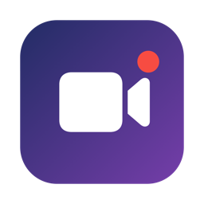

<p align="center">
  
</p>

<h1 align="center">Cameras</h1>

<p align="center">
  Régie caméra minimaliste pour macOS.<br>
  Switchez entre vos webcams avec de vraies transitions, directement dans Teams, Zoom et toutes vos apps vidéo.
</p>

---

Cameras vit dans la barre de menus et expose une **caméra virtuelle** : choisissez « Cameras » comme webcam dans votre app de visio, et pilotez ce qu'elle diffuse — changement de caméra avec fondu, incrustation d'une seconde caméra, image d'attente, filigrane — sans que vos interlocuteurs voient les coulisses.

## Fonctionnalités

- **Multi-caméras** : basculez entre vos webcams (caméra intégrée, USB, iPhone en Continuity Camera) d'un raccourci, avec transition au choix (fondu, cut, slide, volet, punch, fondu flouté).
- **Mode Studio** : une fenêtre de régie pilotée entièrement au clavier — caméras, incrustation, scènes, effets, cadrage, couleur — avec moniteur programme, voyant ON AIR et retour visuel de chaque action.
- **Rotation continue** : l'image tourne sur elle-même (lente, moyenne, rapide, dans les deux sens) et revient d'elle-même à l'horizontale à l'arrêt.
- **Rage quit** : vous en avez marre de la réunion ? L'image vire au rouge, tremble, un bandeau « RAGE QUIT — J'en ai marre. » s'abat, puis l'écran s'éteint comme un vieux téléviseur et reste noir.
- **Scènes** : enregistrez jusqu'à 4 configurations complètes (caméra + cadrage + couleur + incrustation) et rappelez-les d'un geste.
- **Incrustation (PiP)** : une seconde caméra en vignette, position et taille au choix, échangeable avec la caméra principale d'un raccourci.
- **Cadrage et couleur par caméra** : miroir, rotation, zoom continu avec recadrage à la souris, luminosité/contraste/saturation/température — mémorisés pour chaque caméra.
- **Image figée et écran d'attente** : gelez le flux ou affichez votre visuel « je reviens » ; la caméra s'éteint (LED comprise) pendant ce temps.
- **Filigrane** : votre logo incrusté en permanence dans le flux.
- **Capture** : un raccourci et l'image diffusée est enregistrée en PNG sur le Bureau.
- **Aperçu** : une fenêtre montre exactement ce que voit votre app de visio ; une version compacte flotte au-dessus de tout pour surveiller son cadrage en réunion.
- **Sobre par conception** : la capture ne tourne que quand quelqu'un regarde (aperçu ouvert ou client vidéo connecté), capture au format natif des webcams, fréquence réglable 30/24/15 ips, ralentissement automatique si le Mac chauffe. Aucune connexion réseau, tout reste sur votre machine.
- **En français et en anglais.**

## Raccourcis

| Raccourci | Action |
|---|---|
| ⌃⌥1 … ⌃⌥9 | Basculer sur la caméra 1 à 9 |
| ⌃⌥⇧1 … ⌃⌥⇧4 | Rappeler la scène 1 à 4 |
| ⌃⌥0 | Figer / défiger l'image |
| ⌃⌥I | Écran d'attente |
| ⌃⌥P | Échanger caméra active ↔ incrustation |
| ⌃⌥S | Capturer l'image en PNG |
| ⌃⌥R | Ouvrir le Mode Studio (régie) |
| ⌃⌥X, deux fois | Rage quit (le premier appui arme : l'icône passe en flamme pendant 3 s) |

Les modificateurs (⌃⌥ par défaut) se changent dans menu › Réglages › Raccourcis.

## Mode Studio

Menu › **Mode Studio (régie)** (ou ⌃⌥R) ouvre une fenêtre de régie. Tant qu'elle est au premier plan, le clavier pilote tout, sans modificateur — comme sur un mélangeur vidéo. Épinglez-la (icône punaise) pour la garder au-dessus de l'app de visio, idéalement sur un second écran.

| Touche | Action |
|---|---|
| 1 … 9 | Mettre la caméra 1 à 9 à l'antenne (avec la transition choisie) |
| ⇧1 … ⇧9 | Caméra 1 à 9 en incrustation (rappuyer pour la retirer) |
| 0 | Retirer l'incrustation |
| P | Échanger caméra ↔ incrustation |
| C / ⇧C | Coin / taille de l'incrustation |
| ⌥1 … ⌥4 | Rappeler la scène 1 à 4 |
| ⌥⇧1 … ⌥⇧4 | Enregistrer la scène 1 à 4 |
| Espace | Figer / défiger l'image |
| B | Écran d'attente |
| M | Miroir |
| O | Pivoter de 90° |
| R | Rotation continue |
| ⇧R / ⌥R | Vitesse / sens de la rotation continue |
| L | Filigrane |
| T / ⇧T | Style / durée de transition |
| + / − (ou ⇧↑ / ⇧↓) | Zoom |
| ← ↑ ↓ → | Recadrer (une fois zoomé) |
| ⌫ | Réinitialiser le cadrage |
| ⌥↑ / ⌥↓ | Luminosité |
| ⌥← / ⌥→ | Température |
| ⌥⌫ | Réinitialiser la couleur |
| S | Capturer l'image en PNG |
| X, deux fois | Rage quit |

Les chiffres suivent la position physique des touches : sur un clavier AZERTY, pas besoin de ⇧ pour les atteindre.

## Rage quit

Deux appuis sur X (dans la régie) ou sur ⌃⌥X, ou menu › **Rage quit** : pendant 2,7 s, vos interlocuteurs voient l'image rougir, trembler, le bandeau « RAGE QUIT — J'en ai marre. » tomber, puis l'écran s'éteindre. La caméra reste ensuite au noir (écran d'attente, LED éteinte) ; votre app de visio, elle, n'est pas touchée. Pour revenir à l'image, coupez l'écran d'attente (B ou ⌃⌥I).

## Installation

1. Ouvrez le fichier `.dmg` et glissez **Cameras** dans **Applications**.
2. Lancez Cameras (icône caméra dans la barre de menus) et autorisez l'accès à la caméra.
3. Menu › **Installer la caméra virtuelle**, puis autorisez l'extension dans **Réglages Système › Général › Connexion et extensions**.

Mise à jour : glissez la nouvelle version dans **Applications** et remplacez l'ancienne. En retirant l'ancienne app, macOS désinstalle sa caméra virtuelle ; au lancement, Cameras la réinstalle d'elle-même (macOS peut demander de l'autoriser à nouveau). En cas de souci, menu › **Réinstaller la caméra virtuelle**.
4. Dans Teams, Zoom, etc., choisissez la caméra **« Cameras »**.

Nécessite macOS 13 (Ventura) ou plus récent.

## Piloter depuis un Stream Deck ou Raccourcis

Toutes les actions existent en **App Intents** (app Raccourcis, Siri) et via le scheme `cameras://` :

```sh
open "cameras://select/2"        # caméra n°2
open "cameras://scene/1"        # rappelle la scène 1
open "cameras://freeze/toggle"  # figer / défiger
open "cameras://standby/on"     # écran d'attente
open "cameras://swap"           # échange caméra ↔ incrustation
open "cameras://snapshot"       # capture PNG
open "cameras://studio"         # ouvre la régie
open "cameras://spin/toggle"    # rotation continue
open "cameras://ragequit"       # rage quit, sans confirmation
```

## Compiler soi-même

Xcode 16+ sur macOS 13+. Ouvrez `Cameras.xcodeproj`, sélectionnez votre équipe de développement dans *Signing & Capabilities* (pour les deux cibles), puis ⌘R. L'app fonctionne immédiatement ; l'activation de la caméra virtuelle demande un compte Apple Developer payant et une app installée dans `/Applications` — détails dans [docs/DEVELOPMENT.md](docs/DEVELOPMENT.md).
